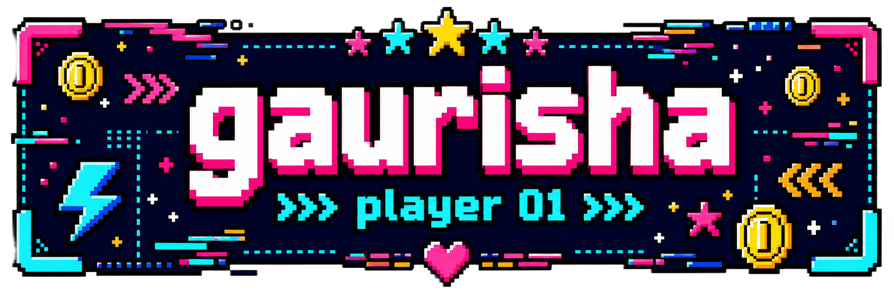

---

### about

i like building systems end to end — auth, data, the interface, the boring parts — mostly because i wanted the thing to exist for myself first.

i care about how something looks as much as how it works. layout, type, spacing, the feel of an interaction. a tool i don't enjoy opening is a tool i stop using.

right now i'm most interested in finance and markets, and in making systems that are hard to read, easier to read.

---

### stack

**languages**

**frontend**

**backend**

**data and ai**

**tooling**

---

### projects

**invoicechain** — a decentralised marketplace where small businesses tokenise unpaid invoices and investors buy fractions of them.

invoices are read with ocr, canonicalised, then hashed with keccak256 and registered on-chain, so the same invoice can never be sold twice. minted as erc-1155, sold through auctions or fixed listings, settled through contract escrow. each listing carries a risk score from a model trained on payment history and seller track record.

`next.js` `fastapi` `postgresql` `solidity` `hardhat` `ethers.js` `tesseract` `xgboost`

→ [repo](https://github.com/fo56/Invoice-Chain) <!-- add link -->

 

**sentinelops nexus** — mission planner with document search that runs entirely on local hardware.

the retrieval layer filters by role before the model sees anything, so out-of-scope documents are rejected at the vector query, not by asking the model to behave. answers below a similarity threshold short-circuit to a fallback instead of guessing. kanban board updates live over websockets. includes a stress-test suite that tries to leak documents across roles and reports whether the boundaries hold.

`react` `fastapi` `mongodb` `chromadb` `ollama` `websockets`

→ [repo](https://github.com/fo56/sentinelops-nexus) <!-- add link -->

 

**hostelhub** — hostel management for students, admins and maintenance staff, deployed and in use.

multiple hostels on one backend with strict data separation. students join through a qr code or a magic link instead of a password. they vote on mess dishes and rate meals, and the weekly menu is generated from those votes alongside cost and nutrition. maintenance issues are reported, assigned, and closed with notes, all updating live.

`typescript` `react` `express` `mongodb` `socket.io` `tailwind`

→ [repo](https://github.com/fo56/hostelHub) <!-- add link -->

 

**ctrl** — a time tracker built around one screen: the whole day as 144 ten-minute blocks.

you fill blocks in as the day goes, and the daily and weekly graphs show where the time actually went. has a full-screen focus timer, notes and a to-do list.

`javascript` `firebase` `chart.js` `css`

→ [repo](https://github.com/fo56/ctrl) <!-- add link -->

---

### contributions

<picture>
  <source media="(prefers-color-scheme: dark)" srcset="https://raw.githubusercontent.com/fo56/fo56/output/github-contribution-grid-snake-dark.svg" />
  <source media="(prefers-color-scheme: light)" srcset="https://raw.githubusercontent.com/fo56/fo56/output/github-contribution-grid-snake.svg" />
  
</picture>

---

### interests

**finance** — markets, and building trading systems that work the way i want them to rather than the way a dashboard decides. this is the direction i want to keep going in.

**legible public systems** — an idea i keep coming back to: laws and parliamentary activity in india presented so a normal person can follow them. what a law actually says, what questions each constituency's representative is raising, sorted by topic. closer to what the netherlands does. not political, just curious what it would take to make it readable. not building it yet.

**interfaces** — pixel art, layout, type, small interactions. the part i enjoy most.

---

### stats

---

### links

<!-- add links above -->

